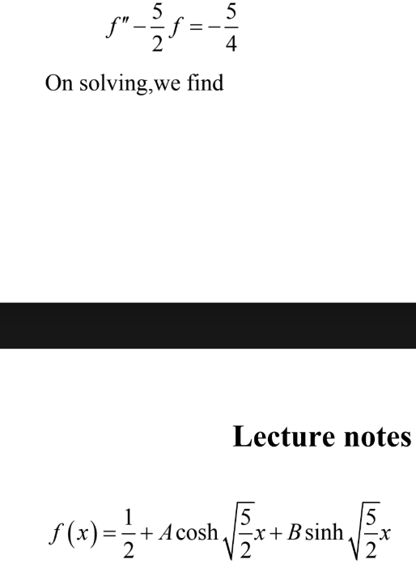

"# Git_" 

https://github.com/login?client_id=0120e057bd645470c1ed&return_to=%2Flogin%2Foauth%2Fauthorize%3Fclient_id%3D0120e057bd645470c1ed%26code_challenge%3DiqwbGS8nvViL5F2Zr97RKoUdBshvtSfaqApcUWp59Dw%26code_challenge_method%3DS256%26redirect_uri%3Dhttp%253A%252F%252F127.0.0.1%253A50683%252F%26response_type%3Dcode%26scope%3Drepo%2Bgist%2Bworkflow%26state%3D49c9f670bbd54586bb43d4426108354a
Public repositories
Read-only access to public repositories.

All repositories
This applies to all current and future repositories you own. Also includes public repositories (read-only).

Only select repositories
Select at least one repository. Max 50 repositories. Also includes public repositories (read-only).

Good thing works well
